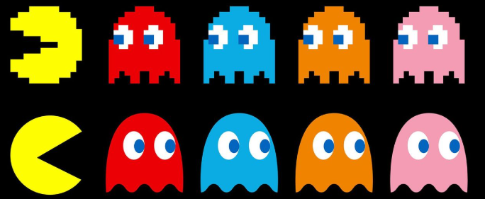

# The Legend of Zelda: Ocarina of Time 
## Ficha Técnica 
- **Desarrollador:** Nintendo EAD 
- **Año:** 1998 
- **Plataforma:** Nintendo 64 
## Sinopsis 
Es una saga de aventuras y acción centrada en el héroe Link, quien debe enfrentar al mal para proteger el reino de Hyrule.

La historia gira en torno a un ciclo recurrente donde Link, la princesa Zelda y el antagonista Ganon representan fuerzas de valor, sabiduría y poder. Generalmente, Ganon amenaza con dominar Hyrule, y Link debe recorrer el mundo, resolver acertijos, explorar mazmorras y obtener artefactos clave —como la Trifuerza— para detenerlo.

Cada entrega presenta una variación de esta lucha, combinando exploración, combate, resolución de puzzles y desarrollo de habilidades, en un mundo que mezcla fantasía, mitología y aventura. 
## Imagen 

