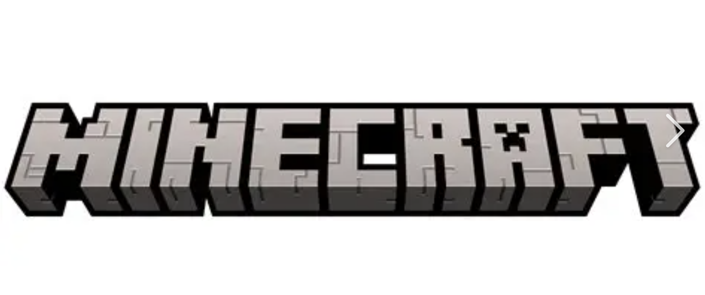

# Minecraft

## Ficha Técnica  
- **Desarrollador:** Mojang Studios  
- **Año:** 2011  
- **Plataforma:** Multiplataforma  

## Sinopsis  
Un juego sandbox donde los jugadores pueden explorar, construir y sobrevivir en un mundo generado proceduralmente hecho de bloques.  

## Imagen  

## Reseña  
Destaca por su creatividad ilimitada, comunidad activa y capacidad de adaptarse a distintos estilos de juego, desde supervivencia hasta construcción libre.