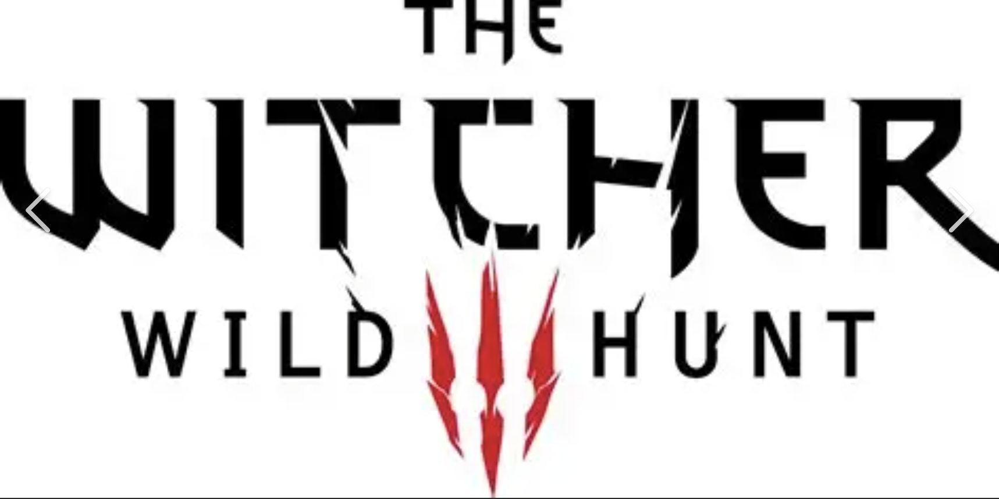

# The Witcher 3

## Ficha Técnica  
- **Desarrollador:** CD Projekt Red  
- **Año:** 2015  
- **Plataforma:** PC, PlayStation 4, Xbox One 

## Sinopsis  
Geralt de Rivia, un cazador de monstruos, busca a su hija adoptiva mientras el mundo es amenazado por la Cacería Salvaje.  

## Imagen  

## Reseña  
Aclamado por su narrativa profunda, mundo abierto detallado y decisiones con consecuencias reales que afectan la historia.